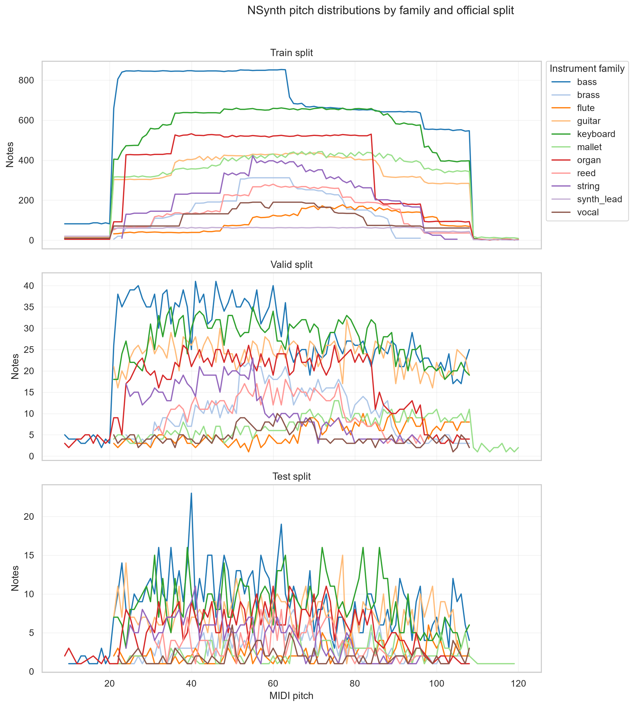
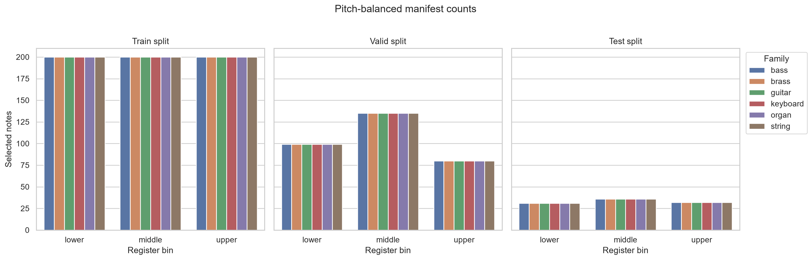
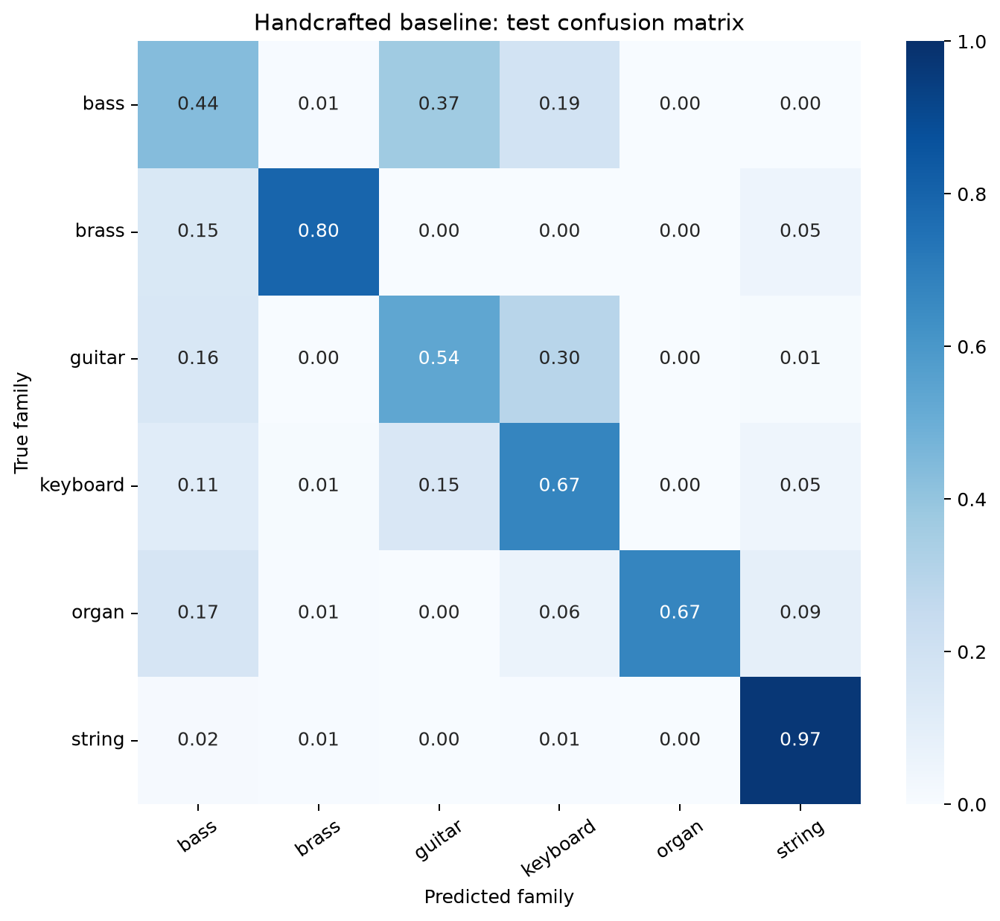
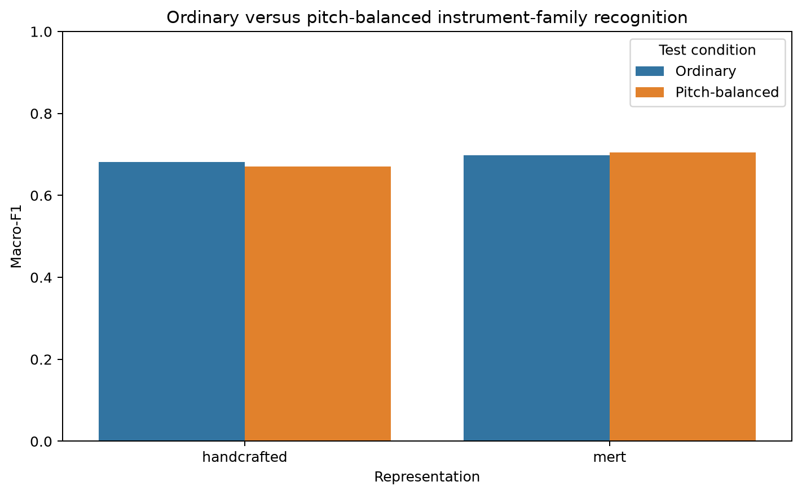
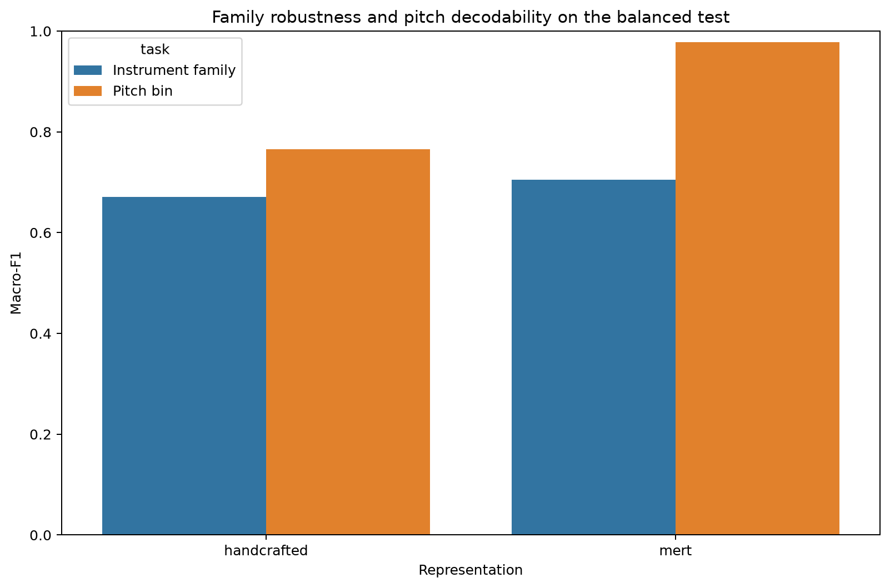
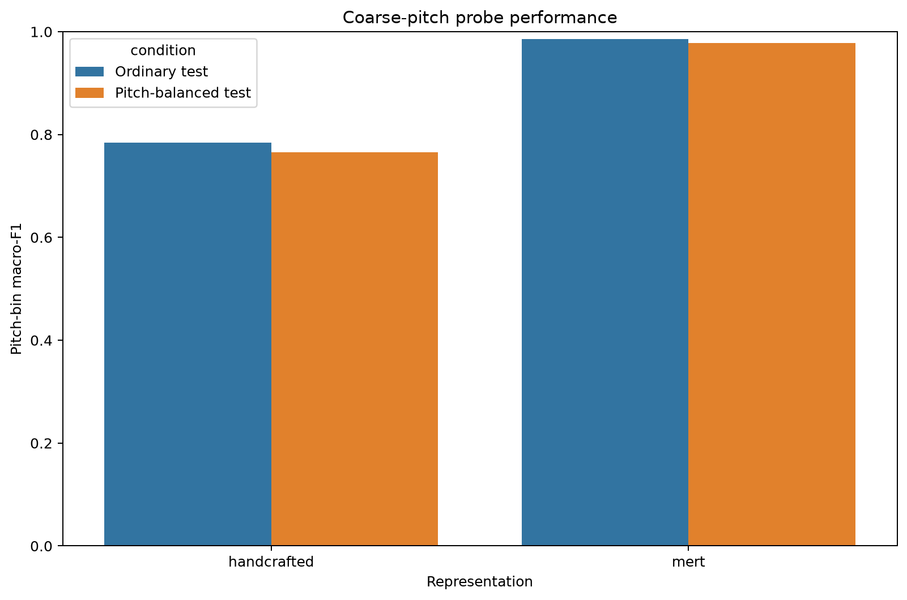

# Pitch, Register, and Instrument-Family Recognition in NSynth

## Research question

> When classifying previously unseen instrument instances, how strongly does instrument-family recognition depend on pitch/register, and do pretrained music representations preserve instrument-family identity across pitch more effectively than conventional acoustic features?

The project compares handcrafted acoustic features with frozen MERT-v0-public embeddings using simple downstream classifiers. The main outcome is the performance change after controlling pitch/register, supported by a separate pitch probe and acoustic analysis.

## Project status and experiment map

The official NSynth splits were preserved. The audit verified 305,979 metadata records and matching WAV files, with 289,205 train, 12,678 validation, and 4,096 test notes. Train source instruments have zero overlap with validation/test instruments.

All core experiments are complete:

| Experiment | Purpose | Status |
|---|---|---|
| Metadata audit and manifest construction | Identify supported families/registers and freeze controlled subsets without using model predictions | Complete |
| Ordinary family classification | Compare 76 handcrafted features with frozen 768-dimensional MERT embeddings | Complete |
| Pitch-balanced family evaluation | Re-evaluate the same fitted classifiers after controlling register and velocity | Complete |
| Coarse-pitch probe | Measure how linearly decodable lower/middle/upper register is from each representation | Complete |
| Acoustic-pair analysis | Illustrate family cues at fixed pitch and within-instrument changes across pitch | Complete |

Accuracy, macro-F1, per-family recall, per-register results, and confusion matrices are reported below. Hyperparameters are selected on validation data only; test rows are never used for fitting or model selection.



**Finding.** Instrument families do not cover pitch uniformly: some are concentrated in lower registers, while others are much more common in middle or upper registers. Therefore, an ordinary family-classification score may partly reward learning these family-specific pitch distributions rather than only learning pitch-robust timbre. This observation motivates the controlled evaluation used in the later experiments.

Additional audit figures:

- [family-by-pitch heatmaps](outputs/figures/metadata_audit/nsynth_family_pitch_heatmaps.png)
- [family-by-velocity heatmaps](outputs/figures/metadata_audit/nsynth_family_velocity_heatmaps.png)
- [note and source-instrument counts](outputs/figures/metadata_audit/nsynth_family_note_and_instrument_counts.png)
- [individual source-instrument contributions](outputs/figures/metadata_audit/source_instrument_contributions.png)
- [source-type composition](outputs/figures/metadata_audit/source_type_composition.png)

## Frozen family and pitch-range decision

The predeclared selection rule is stored in [`configs/nsynth_audit.yaml`](configs/nsynth_audit.yaml). It requires at least four evaluation instruments per family, searches contiguous intervals divisible into three equal registers, and rejects sparse family × register cells.

| Design item | Frozen decision |
|---|---|
| Families | bass, brass, guitar, keyboard, organ, string |
| Common MIDI interval | 43-69 |
| Lower register | 43-51 |
| Middle register | 52-60 |
| Upper register | 61-69 |
| Random seed | 5305 |

Flute, mallet, synth_lead, and vocal failed the minimum evaluation-instrument rule. Reed passed that rule but no seven-family interval satisfied every joint-overlap requirement. The complete decision and thresholds are documented in [`outputs/reports/nsynth_metadata_audit.md`](outputs/reports/nsynth_metadata_audit.md).

## Pitch-balanced manifest

The primary fixed manifest contains 6,078 notes. Within each split, every family has identical counts in each register × velocity cell, and no source instrument contributes more than 50% of a cell.

| Split | Notes | Notes per family |
|---|---:|---:|
| Train | 3,600 | 600 |
| Validation | 1,884 | 314 |
| Test | 594 | 99 |



**Design implication.** Equal family counts inside each register × velocity cell remove the most direct association between the target family and these two metadata variables. The source-instrument cap also reduces the chance that a result is dominated by one instrument. The smaller 594-note test set improves control at the cost of higher sampling uncertainty.

Saved artifacts:

- [`data/manifests/nsynth_pitch_balanced_item_ids.csv`](data/manifests/nsynth_pitch_balanced_item_ids.csv)
- [`data/manifests/nsynth_pitch_balanced_manifest.parquet`](data/manifests/nsynth_pitch_balanced_manifest.parquet)
- [`data/manifests/nsynth_pitch_control_decision.json`](data/manifests/nsynth_pitch_control_decision.json)

A stricter sensitivity manifest additionally matches every retained exact MIDI pitch × velocity cell and only uses pitches jointly supported by all six families. It leaves only 120 test notes (20 per family), so it is useful as a sensitivity check but is too small for the primary per-register analysis:

- [`data/manifests/nsynth_exact_pitch_sensitivity_item_ids.csv`](data/manifests/nsynth_exact_pitch_sensitivity_item_ids.csv)
- [`data/manifests/nsynth_exact_pitch_sensitivity_manifest.parquet`](data/manifests/nsynth_exact_pitch_sensitivity_manifest.parquet)

For the core comparison, the class universe is always the same six selected families. One classifier per representation was trained on all official-train notes from these families and tuned only with validation data. The same fitted classifier was then evaluated on:

1. the ordinary six-family test set restricted to MIDI 43-69 but otherwise unbalanced;
2. the frozen register/velocity-balanced test manifest over the same families and interval.

This makes the ordinary-versus-balanced change interpretable: the representation, classifier, family set, and pitch interval remain fixed. The balanced train/validation manifest rows are reserved for supplementary training-condition sensitivity analysis, not for the primary score-drop comparison. Test rows must never be used for fitting or hyperparameter selection.

## Handcrafted baseline: ordinary result

The classical baseline uses 76 aggregated MFCC/delta, spectral, temporal, RMS/ZCR, and attack descriptors. The StandardScaler and LinearSVC were fitted on all 216,611 official-train notes from the six selected families. Validation selected `C=0.1` from `{0.01, 0.1, 1.0}`. The ordinary test result uses the shared MIDI 43-69 interval without pitch balancing.

| Split | Evaluated notes | Accuracy | Macro-F1 |
|---|---:|---:|---:|
| Validation | 10,421 | 0.5702 | 0.6288 |
| Ordinary test, MIDI 43-69 | 1,244 | 0.6359 | 0.6816 |

**Finding.** The handcrafted representation provides a credible baseline, reaching 0.6816 test macro-F1, but its performance is strongly family-dependent. Test recall ranges from 0.4355 for bass to 0.9699 for string, suggesting that the aggregated spectral and temporal descriptors capture some families much more reliably than others. The higher test score than validation score should not be read as general improvement because the reported test result is restricted to MIDI 43-69 and therefore uses a different pitch distribution.



See the [full baseline report](outputs/results/handcrafted_baseline/README.md), [machine-readable metrics](outputs/results/handcrafted_baseline/ordinary_metrics.json), and [validation C comparison](outputs/results/handcrafted_baseline/validation_c_selection.csv).

## Frozen MERT baseline: ordinary result

The validated MERT cache contains one embedding for each of the same 230,370 selected-family notes used by the handcrafted system: 216,611 train, 10,421 validation, and 3,338 test notes. It uses [`m-a-p/MERT-v0-public`](https://huggingface.co/m-a-p/MERT-v0-public), pins the model revision, takes the final 768-dimensional hidden layer, mean-pools over time, and stores float32 embeddings in resumable NumPy shards.

Each shard has a matching Parquet metadata table. Validation confirmed:

- exactly one embedding per `(split, item_id)`;
- finite 768-dimensional vectors;
- exact coverage of the selected-family official splits;
- complete one-to-one coverage of both frozen controlled manifests.

A StandardScaler and LinearSVC were fitted on the official-train embeddings only. Validation selected `C=1.0`; the ordinary test again uses MIDI 43-69.

| Split | Evaluated notes | Accuracy | Macro-F1 |
|---|---:|---:|---:|
| Validation | 10,421 | 0.6318 | 0.6612 |
| Ordinary test, MIDI 43-69 | 1,244 | 0.6712 | 0.6982 |

**Finding.** Frozen MERT scores higher than the handcrafted baseline on the same ordinary test subset: accuracy is higher by 0.0354 and macro-F1 by 0.0166. The observed difference is modest, and the ordinary result alone does not establish pitch robustness; that requires the controlled comparison below.

See the [MERT baseline report](outputs/results/mert_baseline/README.md), [machine-readable metrics](outputs/results/mert_baseline/ordinary_metrics.json), and [validation C comparison](outputs/results/mert_baseline/validation_c_selection.csv).

## Ordinary versus pitch-balanced evaluation

The already fitted handcrafted and MERT scaler/classifier bundles were evaluated on the frozen 594-note balanced test manifest. Neither representation nor classifier was refitted for this comparison.

| Representation | Ordinary macro-F1 | Balanced macro-F1 | Change | Ordinary accuracy | Balanced accuracy |
|---|---:|---:|---:|---:|---:|
| Handcrafted | 0.6816 | 0.6707 | -0.0108 | 0.6359 | 0.6650 |
| Frozen MERT | 0.6982 | 0.7055 | +0.0073 | 0.6712 | 0.6987 |

**Overall finding.** Controlling the register and velocity distributions produces only small changes in overall macro-F1 for both representations: -0.0108 for handcrafted features and +0.0073 for MERT. This suggests that the aggregate performance of both systems is relatively stable under the controlled evaluation and provides little evidence of a strong overall pitch-confounding effect. MERT achieves higher absolute macro-F1 in both the ordinary and balanced tests, but these small score changes do not establish that MERT is substantially more robust to register than the handcrafted representation. The balanced test also contains only 594 notes, so small differences should be interpreted cautiously.

| Representation | Lower 43-51 | Middle 52-60 | Upper 61-69 |
|---|---:|---:|---:|
| Handcrafted | 0.6593 | 0.6615 | 0.6793 |
| Frozen MERT | 0.7324 | 0.7178 | 0.6571 |

**Register-level finding.** MERT is strongest in the lower and middle registers but drops in the upper register, where the handcrafted result is slightly higher. The difference between representations is therefore not uniform across pitch. These local variations are more pronounced than the very small overall changes after balancing and motivate inspecting family-by-register recall rather than relying only on one aggregate score.




**Family-level finding.** The heatmap shows that aggregate register scores conceal different trends. Handcrafted bass recall falls to 0.2778 in the middle register, while MERT bass recall falls from 0.7742 in the lower register to 0.3438 in the upper register. Guitar recall improves toward the upper register for both representations. Register effects therefore appear to be family-specific rather than a uniform pattern across the dataset.


See the [balanced evaluation report](outputs/results/balanced_evaluation/README.md), [machine-readable metrics](outputs/results/balanced_evaluation/balanced_metrics.json), [family-by-register recall](outputs/results/balanced_evaluation/balanced_family_recall_by_register.csv), and the two normalized confusion matrices for [handcrafted](outputs/figures/balanced_evaluation/handcrafted_balanced_confusion_matrix.png) and [MERT](outputs/figures/balanced_evaluation/mert_balanced_confusion_matrix.png).

## Coarse pitch probe

Separate LinearSVC probes predict lower (43-51), middle (52-60), or upper (61-69) register from the same frozen representations. The probe scaler and classifier are trained only on the 81,379 official-train notes inside the common pitch interval; `C` is selected using 3,793 validation notes. Instrument-family labels are not inputs to the probe.

| Representation | Balanced family macro-F1 | Ordinary pitch macro-F1 | Balanced pitch macro-F1 |
|---|---:|---:|---:|
| Handcrafted | 0.6707 | 0.7845 | 0.7650 |
| Frozen MERT | 0.7055 | 0.9856 | 0.9783 |

**Finding.** Coarse register is almost perfectly linearly decodable from MERT: its balanced pitch-probe macro-F1 is 0.9783, compared with 0.7650 for the handcrafted representation. At the same time, MERT has the higher absolute family-classification macro-F1 on the balanced test. Together, these results show that MERT encodes both pitch and family-related information; they do not, however, prove that MERT is more pitch-robust than the handcrafted representation. The handcrafted probe is weakest in the middle register, whose balanced-test recall is 0.6111.





See the [pitch-probe report](outputs/results/pitch_probe/README.md), [machine-readable metrics](outputs/results/pitch_probe/pitch_probe_metrics.json), [combined family/pitch table](outputs/results/pitch_probe/family_robustness_vs_pitch_probe.csv), and the balanced confusion matrices for [handcrafted](outputs/figures/pitch_probe/handcrafted_balanced_test_confusion_matrix.png) and [MERT](outputs/figures/pitch_probe/mert_balanced_test_confusion_matrix.png).

## Representative acoustic-pair analysis

Four metadata-controlled pairs were selected from the frozen balanced test manifest without using classifier predictions. The two same-pitch pairs match exact MIDI pitch, velocity, and source type while changing family. The two same-family pairs hold source instrument and velocity fixed while spanning the lower and upper registers.

| Comparison | Control | Main observation |
|---|---|---|
| Brass versus string | Both acoustic, MIDI 60, velocity 127 | Brass has a much higher centroid (3930 versus 1628 Hz), while the string note has a shorter attack. |
| Keyboard versus organ | Both electronic, MIDI 43, velocity 100 | Keyboard has an immediate onset; organ takes 1.600 s to rise from 10% to 90% RMS. |
| Brass MIDI 43 versus 68 | Same acoustic source instrument, velocity 50 | f0 increases 4.24 times but centroid only 1.26 times; attack envelopes remain highly correlated (0.906). |
| Organ MIDI 43 versus 69 | Same electronic source instrument, velocity 127 | f0 increases 4.49 times but centroid only 1.36 times; the upper-note attack is 0.384 s longer. |

**Finding.** The matched-pitch examples retain large spectral-envelope and onset differences even after pitch, velocity, and source type are fixed, demonstrating that useful family cues remain beyond register. The matched-instrument examples show that raising pitch does not simply translate an otherwise fixed spectrum upward: centroid/f0 and Mel-envelope shape change substantially. Attack behaviour can remain stable for one source, as in the brass pair, but be register-dependent for another, as in the organ pair. These four examples illustrate plausible mechanisms rather than estimate a population-level effect.

Each pair has a five-panel figure containing waveform, magnitude spectrum, log-Mel spectrogram, Mel-smoothed spectral envelope, and 10%-to-90% RMS attack envelope:

- [same-pitch brass/string](outputs/figures/acoustic_analysis/same_pitch_brass_string.png)
- [same-pitch keyboard/organ](outputs/figures/acoustic_analysis/same_pitch_keyboard_organ.png)
- [same brass source, low/high register](outputs/figures/acoustic_analysis/same_brass_low_high.png)
- [same organ source, low/high register](outputs/figures/acoustic_analysis/same_organ_low_high.png)

See the [full acoustic interpretation](outputs/results/acoustic_analysis/README.md), [selected-pair manifest](outputs/results/acoustic_analysis/selected_acoustic_pairs.csv), [per-item acoustic metrics](outputs/results/acoustic_analysis/acoustic_item_metrics.csv), and [pair-level comparison metrics](outputs/results/acoustic_analysis/acoustic_pair_metrics.csv).

## Main findings and limitations

1. NSynth families have clearly different pitch distributions, so pitch/register is a reasonable potential confound that should be controlled.
2. After controlling register and velocity, overall macro-F1 changes by only -0.0108 for handcrafted features and +0.0073 for MERT. Both representations are therefore relatively stable, and the experiment does not reveal a strong overall pitch-confounding effect.
3. MERT has higher absolute macro-F1 than the handcrafted representation in both the ordinary test (0.6982 vs 0.6816) and the balanced test (0.7055 vs 0.6707). However, the small ordinary-to-balanced changes do not prove that MERT is substantially more robust across registers.
4. The clearer differences occur within particular registers and families. MERT is weaker in the upper register than in the lower and middle registers, and its bass recall falls markedly toward the upper register. Register effects therefore appear to be family-specific rather than uniform.
5. Coarse pitch remains highly decodable from MERT. This shows that MERT retains pitch information alongside family-related information, but it is not direct evidence of greater cross-register robustness.
6. The balanced test contains only 594 notes, so small differences should not be treated as strong causal or statistical-significance evidence. Exact-pitch sensitivity and cross-register generalisation remain useful follow-up experiments.

## Reproduce the completed experiments

### 1. Environment

```powershell
python -m venv .venv
.\.venv\Scripts\Activate.ps1
python -m pip install --upgrade pip
python -m pip install -r requirements.txt -r requirements-mert.txt
```

[`requirements-mert.txt`](requirements-mert.txt) constrains the Transformers and Hugging Face packages to versions compatible with the pinned MERT model. The default MERT configuration uses CUDA: for GPU extraction, install a CUDA-compatible PyTorch and TorchAudio build using the official PyTorch installer before running the command above. For CPU-only extraction, use the same requirements command and change `inference.device` in [`configs/mert_embeddings.yaml`](configs/mert_embeddings.yaml) to `cpu` (substantially slower). [`requirements-lock.txt`](requirements-lock.txt) records the pinned core analysis environment for reference; PyTorch and the MERT-specific packages are managed separately because their correct builds depend on the compute platform.

### 2. Dataset layout

Download and extract the official NSynth train, validation, and test archives into this structure:

```text
data/raw/nsynth/extracted/
├── nsynth-train/
│   ├── examples.json
│   └── audio/*.wav
├── nsynth-valid/
│   ├── examples.json
│   └── audio/*.wav
└── nsynth-test/
    ├── examples.json
    └── audio/*.wav
```

Raw audio, handcrafted feature caches, and MERT embedding shards are intentionally excluded from Git.

### 3. Run the pipeline

```powershell
# Build and audit metadata; freeze the controlled manifests.
python scripts\build_metadata.py --config configs\nsynth_metadata.yaml
python scripts\run_metadata_audit.py --config configs\nsynth_audit.yaml

# Extract and train the handcrafted family baseline.
python scripts\extract_handcrafted_features.py --config configs\handcrafted_baseline.yaml --cache-tag ordinary
python scripts\train_handcrafted_baseline.py --config configs\handcrafted_baseline.yaml --cache-tag ordinary

# Extract and train the frozen-MERT family baseline.
python scripts\extract_mert_embeddings.py --config configs\mert_embeddings.yaml
python scripts\train_mert_baseline.py --config configs\mert_baseline.yaml

# Reuse the fitted representations/models for the controlled analyses.
python scripts\evaluate_balanced.py --config configs\balanced_evaluation.yaml
python scripts\train_pitch_probe.py --config configs\pitch_probe.yaml
python scripts\run_acoustic_analysis.py --config configs\acoustic_analysis.yaml

# Run the automated checks.
pytest -q
```

Feature and embedding extraction are resumable. An existing MERT cache can be checked without inference:

```powershell
python scripts\extract_mert_embeddings.py --config configs\mert_embeddings.yaml --validate-only
```

## Repository guide

| Path | Contents |
|---|---|
| [`configs/`](configs/) | Frozen dataset, feature, model, and analysis settings |
| [`scripts/`](scripts/) | Command-line entry points for all completed experiments |
| [`src/`](src/) | Metadata, feature extraction, modelling, and analysis code |
| [`tests/`](tests/) | Automated checks for metadata, caches, models, and analyses |
| [`data/manifests/`](data/manifests/) | Versioned controlled-subset definitions |
| [`outputs/results/`](outputs/results/) | Reports, metrics, predictions, and result tables |
| [`outputs/figures/`](outputs/figures/) | Audit, classifier, pitch-probe, and acoustic-analysis figures |

Machine-readable JSON and CSV files under [`outputs/results/`](outputs/results/) are the source of truth for the rounded values shown here.
