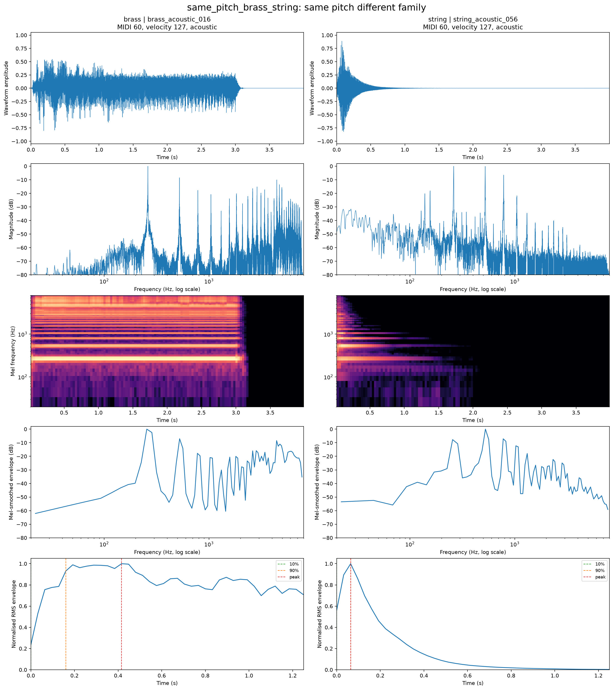
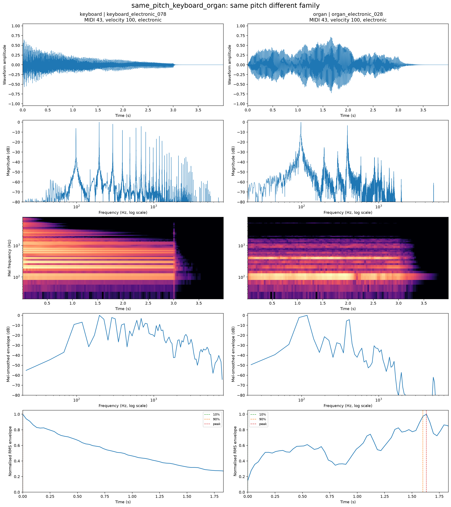
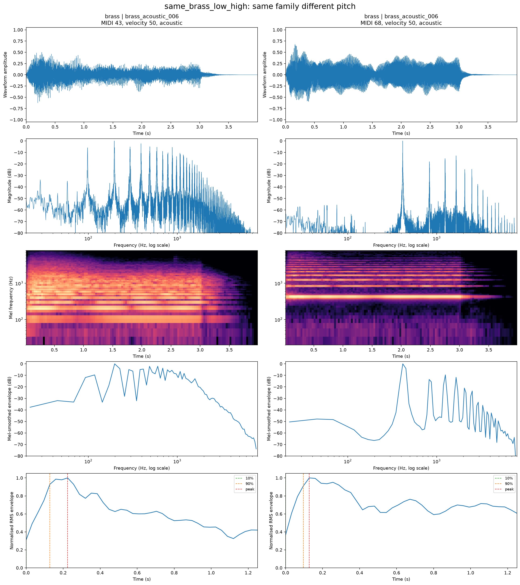
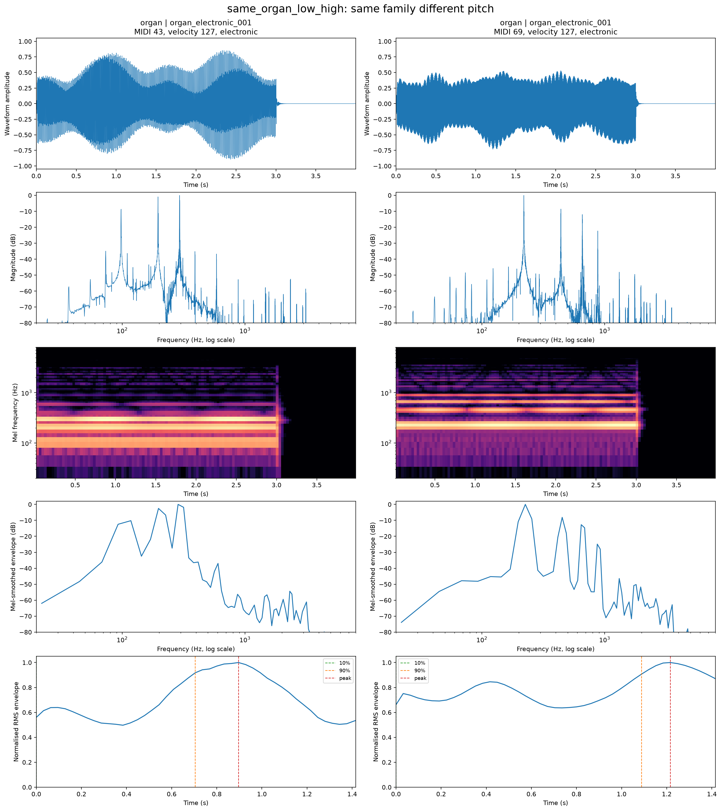

# Representative Acoustic-Pair Analysis

## Selection protocol

All examples come from the frozen 594-note balanced test manifest. Same-pitch pairs match exact MIDI pitch, velocity, and source type while changing family. Same-family pairs match source instrument and velocity while spanning the lower and upper registers. Selection uses metadata only, not classifier correctness.

Each figure contains waveform, high-resolution magnitude spectrum, log-Mel spectrogram, time-averaged Mel-smoothed spectral envelope, and normalised RMS attack envelope. Attack duration uses the same 10%-to-90% definition as the handcrafted baseline.

## Selected comparisons

| Pair | Type | A | B | Controlled metadata |
|---|---|---|---|---|
| same_pitch_brass_string | same_pitch_different_family | brass_acoustic_016-060-127 | string_acoustic_056-060-127 | MIDI 60; velocity 127; source acoustic |
| same_pitch_keyboard_organ | same_pitch_different_family | keyboard_electronic_078-043-100 | organ_electronic_028-043-100 | MIDI 43; velocity 100; source electronic |
| same_brass_low_high | same_family_different_pitch | brass_acoustic_006-043-050 | brass_acoustic_006-068-050 | instrument brass_acoustic_006; velocity 50 |
| same_organ_low_high | same_family_different_pitch | organ_electronic_001-043-127 | organ_electronic_001-069-127 | instrument organ_electronic_001; velocity 127 |

## Pair-by-pair interpretation

### same_pitch_brass_string

Both are acoustic-source notes at MIDI 60 and velocity 127; the comparison isolates brass-versus-string timbre in the middle register.

Pitch (60) and velocity (127) are fixed, so the visible harmonic-envelope and onset differences are not caused by register. Sample A has the higher mean spectral centroid (3930 versus 1628 Hz for A/B), while sample B has the shorter 10-90% attack (0.160 versus 0.064 s). The Mel-envelope cosine similarity is 0.339; the remaining differences therefore provide direct family/timbre cues under matched pitch metadata.



### same_pitch_keyboard_organ

Both are electronic-source notes at MIDI 43 and velocity 100; the comparison isolates keyboard-versus-organ timbre in the lower register.

Pitch (43) and velocity (100) are fixed, so the visible harmonic-envelope and onset differences are not caused by register. Sample A has the higher mean spectral centroid (1542 versus 1234 Hz for A/B), while sample A has the shorter 10-90% attack (0.000 versus 1.600 s). The Mel-envelope cosine similarity is 0.198; the remaining differences therefore provide direct family/timbre cues under matched pitch metadata.



### same_brass_low_high

The same acoustic brass source instrument and velocity are compared across a 25-semitone lower-to-upper register shift.

The source instrument and velocity are fixed while pitch rises by 25 semitones, an expected f0 ratio of 4.24. The spectral centroid changes by a factor of 1.26, and centroid/f0 changes from 16.17 to 4.82; this shows that the spectrum does not move as a perfectly pitch-invariant template. The upper note's 10-90% attack is 0.032 s shorter, while the Mel-envelope similarity is 0.211. Thus register changes both harmonic placement and aspects of the apparent timbre within one source instrument.



### same_organ_low_high

The same electronic organ source instrument and velocity are compared across a 26-semitone lower-to-upper register shift.

The source instrument and velocity are fixed while pitch rises by 26 semitones, an expected f0 ratio of 4.49. The spectral centroid changes by a factor of 1.36, and centroid/f0 changes from 5.26 to 1.59; this shows that the spectrum does not move as a perfectly pitch-invariant template. The upper note's 10-90% attack is 0.384 s longer, while the Mel-envelope similarity is 0.190. Thus register changes both harmonic placement and aspects of the apparent timbre within one source instrument.



## Interpretation limits

These examples illustrate mechanisms rather than estimate population-level effects. NSynth source type, recording chain, and synthesis design can also affect spectra and envelopes. The controlled classifier experiments provide the aggregate evidence; these plots explain acoustically plausible reasons for the observed register dependence.

## Reproduce

```powershell
python scripts\run_acoustic_analysis.py --config configs\acoustic_analysis.yaml
```
