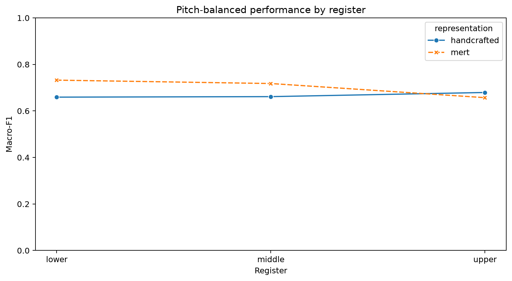
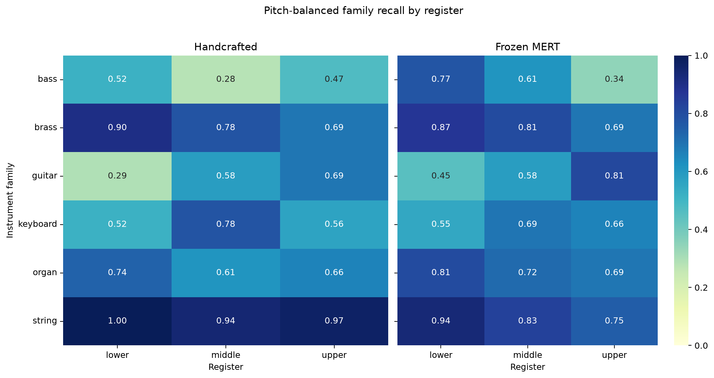

# Ordinary versus Pitch-Balanced Evaluation

Both train-only-fitted scaler/classifier bundles were reused without refitting.

## Overall results

| Representation | Ordinary macro-F1 | Balanced macro-F1 | Change | Ordinary accuracy | Balanced accuracy |
|---|---:|---:|---:|---:|---:|
| handcrafted | 0.6816 | 0.6707 | -0.0108 | 0.6359 | 0.6650 |
| mert | 0.6982 | 0.7055 | +0.0073 | 0.6712 | 0.6987 |

## Balanced overall performance by register

| Representation | Register | Rows | Accuracy | Macro-F1 |
|---|---|---:|---:|---:|
| handcrafted | lower | 186 | 0.6613 | 0.6593 |
| handcrafted | middle | 216 | 0.6620 | 0.6615 |
| handcrafted | upper | 192 | 0.6719 | 0.6793 |
| mert | lower | 186 | 0.7312 | 0.7324 |
| mert | middle | 216 | 0.7083 | 0.7178 |
| mert | upper | 192 | 0.6562 | 0.6571 |

## Interpretation guardrail

A performance decrease after balancing is evidence that the ordinary score benefited from family-specific pitch/register distributions. Stability or improvement suggests stronger robustness under the controlled distribution. The balanced test has 594 notes, so per-register and per-family estimates should be interpreted with their support counts.

Detailed predictions, the family-by-register recall table, and its heatmap are stored beside this report.
